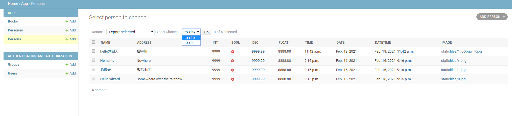
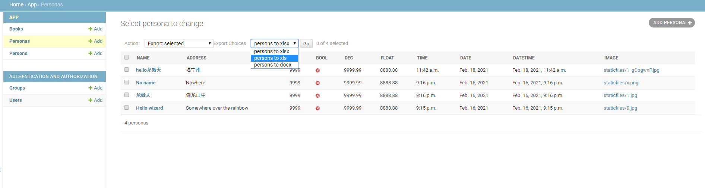

# django-excel-export

A Django library for exporting data.

[Live Demo](https://tranquil-tundra-83829.herokuapp.com/)  
-  User: admin
-  Password: admin   

[Demo Source Code]()

Features:

- support xlsx, xls, docx

## How to install

```sh
$ pip install excel-exporter
```


## How to use

Export is achieved by subclassing ExportAdmin, which implements export as an admin action.

```python
# app/admin.py
from excel_exporter.admin import ExportAdmin

class PersonAdmin(ExportAdmin):
    list_display = ( 'name', 'address', ...)
    export_fields = ('name', 'address', ...)
    
```


You can define custom export action and add it to export_actions list:

```python
# app/admin.py
from excel_exporter.admin import ExportAdmin
from excel_exporter.action import Docx
class PersonExportDocx(Docx):
    desc = 'persons to docx'
    tpl = 'persons.docx'
    queryset_name = 'ps'

    def get_payloads(self, queryset, list_display):
        payload = super().get_payloads(queryset, list_display)
        payload['test'] = 'A Big Company'
        payload['logo'] = 'staticfiles/1.jpg'
        return payload

class PersonaAdmin(ExportAdmin):
    list_display = ( 'name', 'address', ...)
    export_actions = [PersonExportDocx, ...] 

    
```


See [admin.py](https://github.com/zhangyu836/django-excel-export-demo/blob/main/demo/app/admin.py) in [Demo Source Code](https://github.com/zhangyu836/django-excel-export-demo).